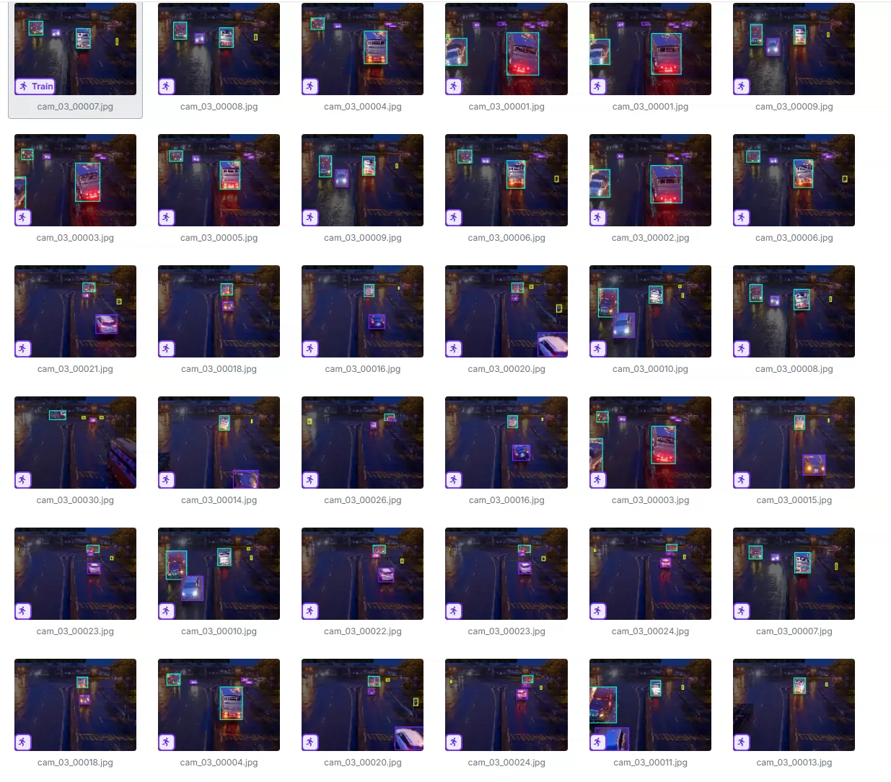
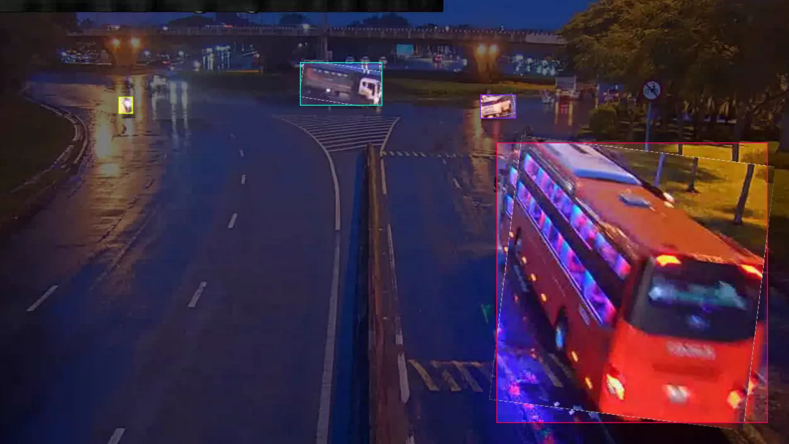
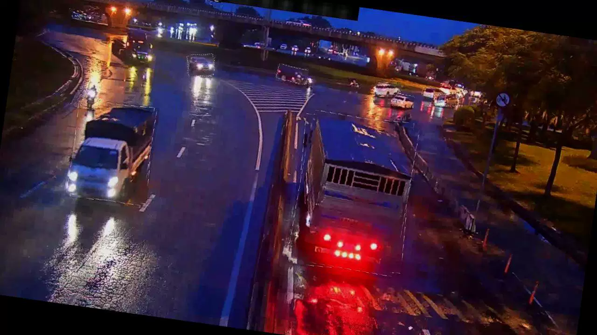
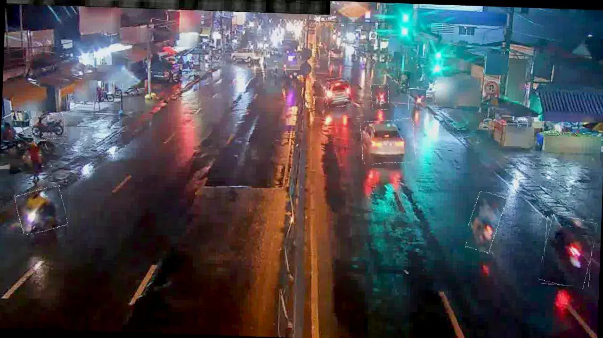
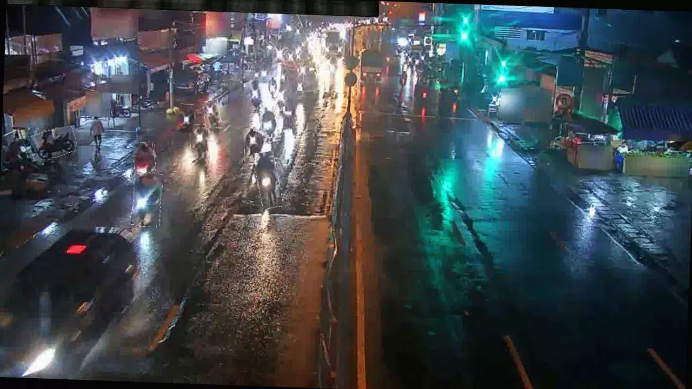

## Body

"Yolo format for nighttime vehicle electric vehicle target recognition dataset with over 10,000 images labeled

The dataset is divided into four categories: electric vehicles, cars, trucks, and buses.

Some images in the dataset have a virtual frame around them.

Electronic virtual products are sold without return or exchange."

## Images

item_1034717573590

Here is a pay link on Stripe ( https://buy.stripe.com/3cs8yP7sY87d0vu9AB ). Please contact me lonlonago@foxmail.com after funding $89, and I will send you a complete data files , thank you!

